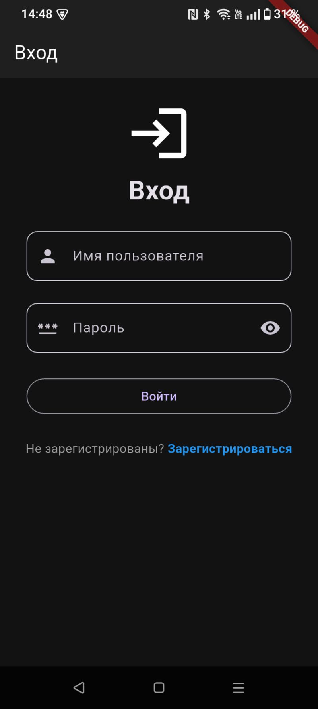
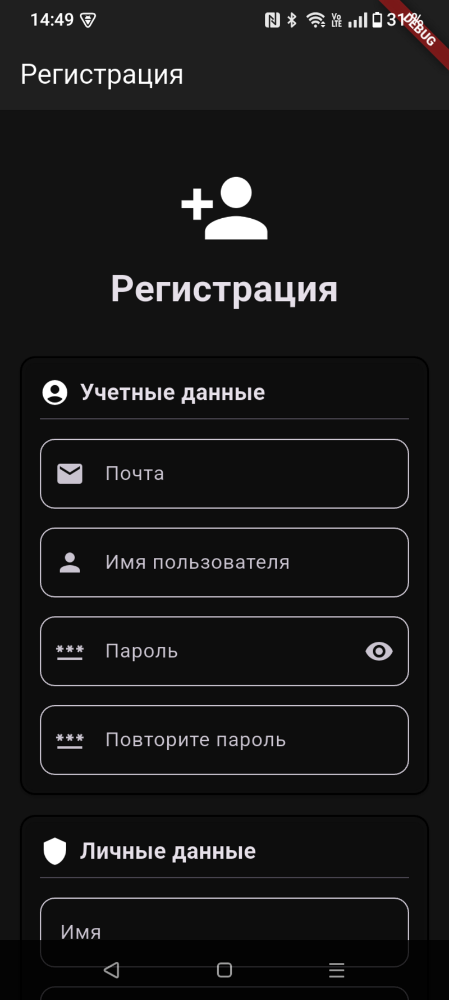
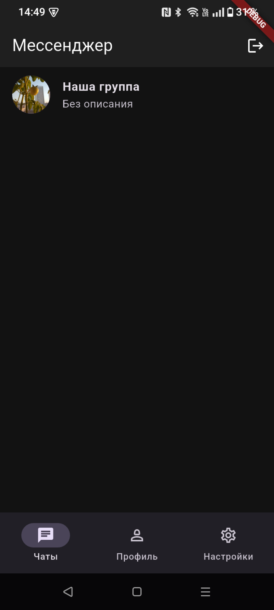
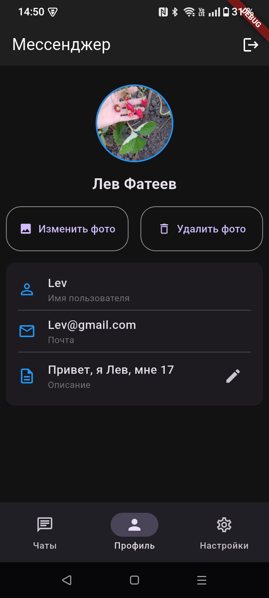
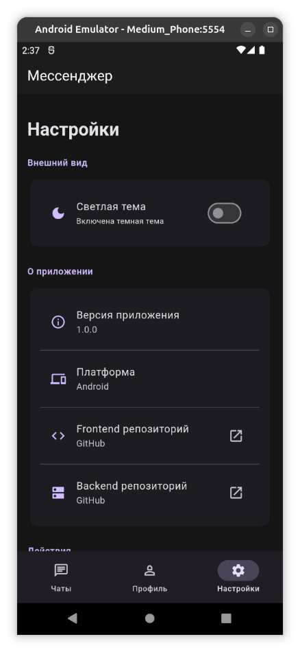
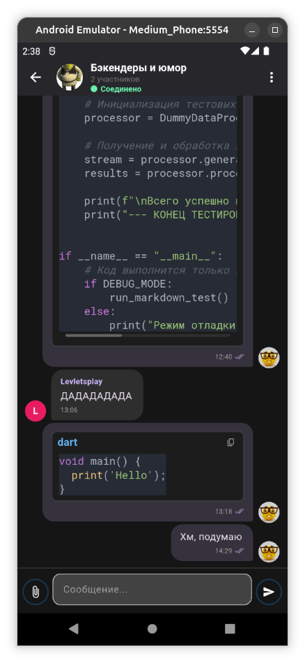
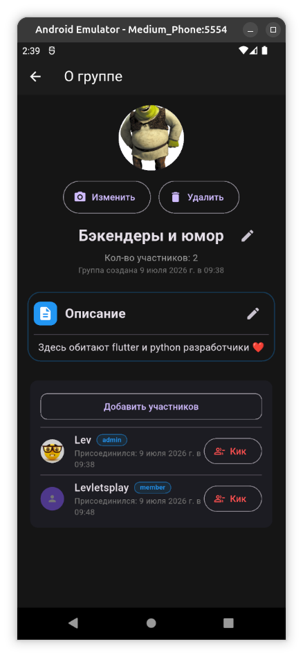

# Messenger App 📱

Кроссплатформенное мобильное приложение-мессенджер, разработанное на Flutter. Является фронтендом для [Messenger Backend](https://github.com/Levletsplay0/Messenger) и бэкенд задеплоен: http://45.132.255.102:8000/docs

> 🚧 **Проект заморожен**  
> Приложение находится в недоработанном состоянии, и разработка временно заморожена, т.к. автор стал больше тратить время на учебу, нежели на этот проект. Но в будущем планируется многое!
> 
> **Это отличная возможность внести вклад!** Задач много: от полировки и добавления фич в бэкенд до подключения API к Flutter-приложению. Можешь прямо сейчас сделать форк, реализовать фичу и отправить pull request. Или напиши мне в Telegram по поводу проекта, и я отвечу на все вопросы: [@Levletsplay](https://t.me/Levletsplay)


## 🌟 Уникальные возможности для разработчиков

Этот мессенджер создан **программистами для программистов**:

- 🐙 **Глубокая интеграция с GitHub** — просмотр репозиториев, PR и Issues прямо в чате (В будущем)
- 💻 **Подсветка синтаксиса кода** — нативное форматирование в сообщениях (Уже реализовано)
- 📞 **Голосовые и видеозвонки** - в будущем
- 💾 **Кэширование сообщений** - в будущем


## 📸 Скриншоты















## 📋 Текущий функционал
- 🔐 **Аутентификация**
  - Регистрация нового пользователя (имя, фамилия, email, username, пароль)
  - Вход в систему с сохранением токена
  - Splash screen с проверкой авторизации
  
- 👤 **Профиль пользователя**
  - Просмотр информации профиля (имя, email, username, описание)
  - Загрузка и изменение аватара
  - Удаление аватара
  - Редактирование описания профиля (до 100 символов)
  
- 💬 **Чаты**
  - Отображение списка групп/чатов
  - Отображение сообщений
  - Показ аватаров чатов и пользователей
  - Отображение названия и описания чата
  
- ⚙️ **Настройки**
  - Функциональный экран настроек
  - Выбор темы и выход из аккаунта
  - Версия приложения
  - Платформа устройства
  - Кнопки с ссылками на репозитории
  - Очистка кэша
  - Выход из аккаунта
  
- 🎨 **Интерфейс**
  - Material design
  - Поддержка светлой и темной темы с dynamic color
  - Нижняя навигационная панель
  - Адаптивный дизайн
  - Индикаторы загрузки и обработки ошибок
  - Подходит для любых устройств (desktop и mobile)

## 📦 Зависимости

```yaml
dependencies:
  flutter:
    sdk: flutter
  http: ^1.6.0
  cupertino_icons: ^1.0.8
  shared_preferences: ^2.5.5
  file_picker: ^10.3.8
  web_socket_channel: ^3.0.3
  intl: ^0.20.2
  dio: ^5.4.0
  path_provider: ^2.1.1
  permission_handler: ^12.0.0
  package_info_plus: ^8.0.0
  flutter_octicons: ^1.72.0
  provider: ^6.1.2
  url_launcher: ^6.2.5
  connectivity_plus: ^6.0.3
  flutter_cache_manager: ^3.4.1
  flutter_markdown_plus: ^1.0.12
  flutter_highlight: ^0.7.0
  markdown: ^7.3.1
```

## 🏗 Структура проекта

```
lib/
├── main.dart                      # Точка входа, SplashScreen
├── screens/
│   ├── login_screen.dart          # Экран входа
│   ├── register_screen.dart       # Экран регистрации
│   ├── chats_screen.dart          # Главный экран с навигацией
│   ├── chats_page.dart            # Список чатов/групп
│   ├── profile_page.dart          # Профиль пользователя
│   ├── settings_page.dart         # Настройки
│   ├── edit_description_page.dart # Редактирование описания
│   ├── add_members_screen.dart    # Добавление пользователей в чат
│   ├── create_group_page.dart     # Создание группы
│   ├── group_info_screen.dart     # Информация о группе
│   ├── users_profile_screen.dart  # Профиль людей из чата
│   └── chat_screen.dart           # Чат с сообщениями
├── providers/
│   └── theme_provider.dart        # Сервис для получения из SharedPreference темы
├── services/
│   ├── api_service.dart           # Сервис для работы с API
│   └── websocket_service.dart     # Сервис для работы с websocket
├── theme/
│    └── app_theme.dart            # Тема приложения
└── widgets/
      └── message_content.dart     # Виджет для рендера markdown  
```

## 🚀 Установка и запуск

### Предварительные требования
- Flutter SDK (последняя стабильная версия)
- Dart SDK
- Android Studio / Xcode (для эмуляторов)
- VS Code (по желанию)
- Доступ к бэкенду: `http://45.132.255.102:8000`

### Шаги установки

1. Клонируйте репозиторий:
```bash
git clone https://github.com/Levletsplay0/MessengerApp.git
cd MessengerApp
```

2. Установите зависимости:
```bash
flutter pub get
```

3. Запустите приложение:
```bash
flutter run
```

Для запуска на конкретном устройстве:
```bash
flutter run -d <device_id>
```

Список доступных устройств:
```bash
flutter devices
```

## 🤝 Contributing

Проект находится в ранней стадии разработки. Если вы хотите помочь:

1. Форкните репозиторий
2. Создайте ветку для вашей фичи (`git checkout -b feature/AmazingFeature`)
3. Закоммитьте изменения (`git commit -m 'Add some AmazingFeature'`)
4. Запушьте в ветку (`git push origin feature/AmazingFeature`)
5. Откройте Pull Request

## 🔗 Ссылки

- [Backend Repository](https://github.com/Levletsplay0/Messenger)
- [Документация Flutter](https://flutter.dev/docs)
- [Learn Flutter](https://flutter.dev/learn)

---

**Статус проекта**: 🚧 В активной разработке

> **👨‍💻 Автор:** [@Levletsplay0](https://github.com/Levletsplay0)  
> **Поставьте ⭐, если проект был полезен!**
